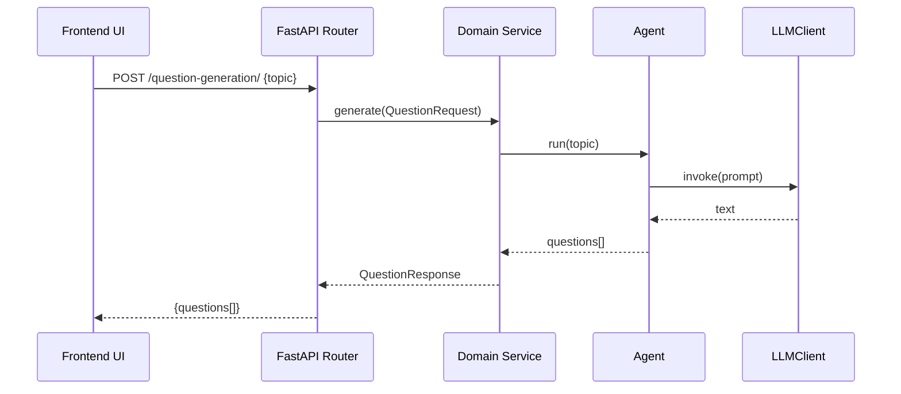
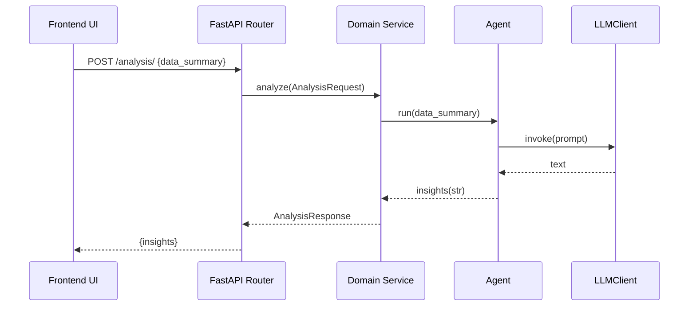
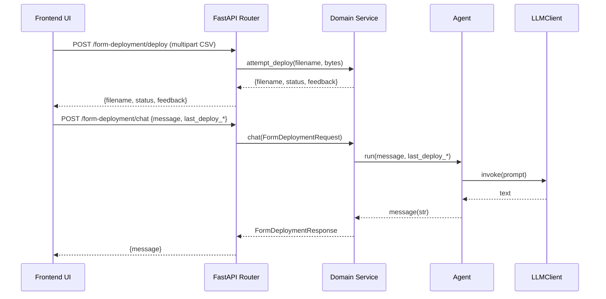

# SensibleForms – Example Data Flow

This repository is structured to demonstrate how three LLM-powered “chatbots” (domains) communicate through a unified FastAPI backend and a frontend UI.

Even if Gemini credentials are not configured, the backend remains runnable because it falls back to a deterministic mock LLM client.

## High-level shape

- **Frontend UI** calls one of the domain endpoints.
- **API router** validates input (Pydantic), then calls the domain service.
- **Domain service** orchestrates an agent.
- **Agent** builds a prompt and calls an **LLMClient**.
- **LLM provider** is selected by a small factory:
  - Gemini if configured
  - otherwise a mock client (ONLY IN DEVELOPMENT)

### Special case: Form Deployment

- `POST /form-deployment/deploy` is **deterministic**: validate CSV → return deterministic `{status, feedback}`.
- `POST /form-deployment/chat` is **LLM-assisted**: use the last deterministic result (if provided) to explain what went wrong / what to do next.

## Request/response contracts

- `POST /question-generation/`
  - Request: `{ "topic": string }`
  - Response: `{ "questions": string[] }`

- `POST /analysis/`
  - Request: `{ "data_summary": string }`
  - Response: `{ "insights": string }`

- `POST /form-deployment/`
  - (Alias) Chat endpoint

- `POST /form-deployment/deploy`
  - Multipart form-data file upload (CSV only)
  - Response: `{ "filename": string, "status": "success"|"error", "feedback": string }`

- `POST /form-deployment/chat`
  - Request: `{ "message": string, "last_deploy_filename"?: string|null, "last_deploy_status"?: string|null, "last_deploy_feedback"?: string|null }`
  - Response: `{ "message": string }`

- `POST /uploads/`
  - Multipart form-data file upload (CSV only)
  - Response: `{ "filename": string }`

## Sequence diagrams

### Question generation

### Analysis assistant

### Form deployment

## How to run the example

### Backend

1. Create/activate a virtualenv.
2. Install deps:
   - `pip install -r backend/requirements.txt`
3. Optional: enable real Gemini calls.
   - Install the optional dependency: `google-genai` (already listed in `backend/requirements.txt`).
   - Set `GEMINI_API_KEY` (or `GOOGLE_API_KEY`) in a `.env` file.
4. Start the API (pick one):
   - From repo root: `uvicorn app.main:app --app-dir backend --reload`
   - From `backend/`: `uvicorn app.main:app --reload`

Note: `pydantic-settings` uses `env_file=".env"` relative to the current working directory.
If you run from repo root, place `.env` in the repo root. If you run from `backend/`, place `.env` in `backend/`.

### Frontend

1. `cd frontend`
2. Install deps: `npm install`
3. Start dev server: `npm run dev`
4. Ensure backend is running on `http://localhost:8000` (or `http://127.0.0.1:8000`)
   - Override with `VITE_API_BASE_URL`

## Options on how to verify communication

- Follow the `How to run` instructions, above.
- Run tests (uses mock LLM by default): `pytest` in `backend/`.
- Or call endpoints directly with curl/Postman.
