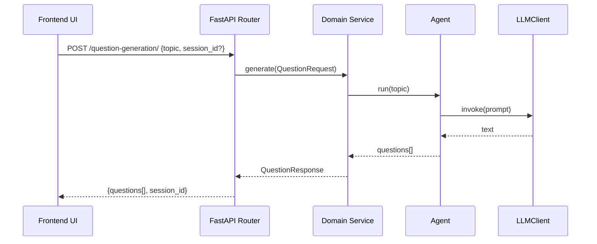
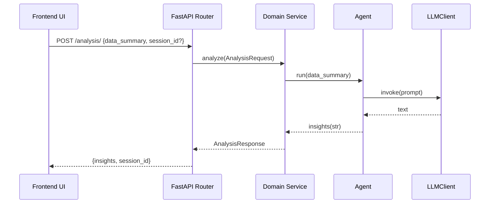
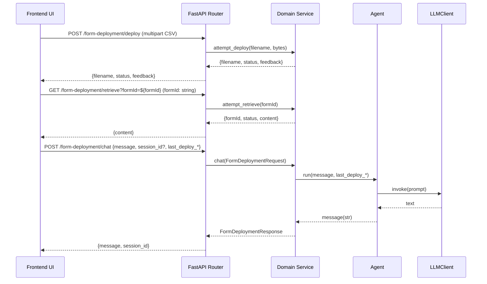

# SensibleForms – Example Data Flow

This repository is structured to demonstrate how three LLM-powered “chatbots” (domains) communicate through a unified FastAPI backend and a frontend UI.

Even if Gemini credentials are not configured, the backend remains runnable because it falls back to a deterministic mock LLM client.

## High-level shape

- **Frontend UI** calls one of the domain endpoints.
- **API router** validates input (Pydantic), then calls the domain service.
- **Domain service** orchestrates an agent.
- **Agent** builds a prompt and calls an **LLMClient**.
- **LLM provider** is selected by a small factory:
  - Gemini if configured
  - otherwise a mock client (ONLY IN DEVELOPMENT)

### Special case: Form Deployment

- `POST /form-deployment/deploy` is **deterministic**: validate CSV → return deterministic `{status, feedback}`.
- `GET /form-deployment/retrieve?formId=${formId}` is **deterministic**: call API with formId → return deterministic `{formId, status, content}`
- `POST /form-deployment/chat` is **LLM-assisted**: use the last deterministic result (if provided) to explain what went wrong / what to do next.

## Request/response contracts

### Session-based conversational context

Each chat-style endpoint supports **conversation memory** by accepting an optional `session_id` (UUID).

- If you send the same `session_id` on multiple calls, the backend reuses the same LangGraph checkpoint thread via a `thread_id` shaped like `"{domain}:{session_id}"`.
- If you omit `session_id`, the backend generates a new UUID and returns it in the response.

The example frontend persists a UUID per page (domain) using `localStorage` (see `frontend/src/services/session.js`) and sends it on each request.

- `POST /question-generation/`
  - Request: `{ "topic": string, "session_id"?: string }`
  - Response: `{ "questions": string[], "session_id": string }`

- `POST /analysis/`
  - Request: `{ "data_summary": string, "session_id"?: string }`
  - Response: `{ "insights": string, "session_id": string }`

- `POST /form-deployment/`
  - (Alias) Chat endpoint

- `POST /form-deployment/deploy`
  - Request: Multipart form-data file upload (CSV only)
  - Response: `{ "filename": string, "status": "success"|"error", "feedback": string }`

- `GET /form-deployment/retrieve?formId=${formId}`
  - Request: `{"formId": string}`
  - Response: `{"content": JSON}`

- `POST /form-deployment/chat`
  - Request: `{ "message": string, "session_id"?: string, "last_deploy_filename"?: string|null, "last_deploy_status"?: string|null, "last_deploy_feedback"?: string|null }`
  - Response: `{ "message": string, "session_id": string }`

- `POST /uploads/`
  - Multipart form-data file upload (CSV only)
  - Response: `{ "filename": string }`

## Sequence diagrams

### Question generation

```mermaid
sequenceDiagram
  participant UI as Frontend UI
  participant API as FastAPI Router
  participant SVC as Domain Service
  participant AG as Agent
  participant LLM as LLMClient

  UI->>API: POST /question-generation/ {topic, session_id?}
  API->>SVC: generate(QuestionRequest)
  SVC->>AG: run(topic)
  AG->>LLM: invoke(prompt)
  LLM-->>AG: text
  AG-->>SVC: questions[]
  SVC-->>API: QuestionResponse
  API-->>UI: {questions[], session_id}
```

### Analysis assistant

```mermaid
sequenceDiagram
  participant UI as Frontend UI
  participant API as FastAPI Router
  participant SVC as Domain Service
  participant AG as Agent
  participant LLM as LLMClient

  UI->>API: POST /analysis/ {data_summary, session_id?}
  API->>SVC: analyze(AnalysisRequest)
  SVC->>AG: run(data_summary)
  AG->>LLM: invoke(prompt)
  LLM-->>AG: text
  AG-->>SVC: insights(str)
  SVC-->>API: AnalysisResponse
  API-->>UI: {insights, session_id}
```

### Form deployment

```mermaid
sequenceDiagram
  participant UI as Frontend UI
  participant API as FastAPI Router
  participant SVC as Domain Service
  participant AG as Agent
  participant LLM as LLMClient

  UI->>API: POST /form-deployment/deploy (multipart CSV)
  API->>SVC: attempt_deploy(filename, bytes)
  SVC-->>API: {filename, status, feedback}
  API-->>UI: {filename, status, feedback}

  UI->>API: GET /form-deployment/retrieve?formId=${formId} (formId: string)
  API->>SVC: attempt_retrieve(formId)
  SVC-->>API: {formId, status, content}
  API-->>UI: {content}

  UI->>API: POST /form-deployment/chat {message, session_id?, last_deploy_*}
  API->>SVC: chat(FormDeploymentRequest)
  SVC->>AG: run(message, last_deploy_*)
  AG->>LLM: invoke(prompt)
  LLM-->>AG: text
  AG-->>SVC: message(str)
  SVC-->>API: FormDeploymentResponse
  API-->>UI: {message, session_id}
```

## How to run the example

### Backend

1. Create/activate a virtualenv.
2. Install deps:
  - `pip install -r requirements.txt`
3. Optional: enable real Gemini calls.
  - Install the optional dependency: `google-genai` (already listed in `requirements.txt`).
  - Set `GEMINI_API_KEY` in the repo-root `.env` file as `GOOGLE_API_KEY`.
4. Optional: enable Google Forms API calls. 
  - Place `client_secrets.json` into backend directory
5. Start the API (pick one):
  - From repo root: `uvicorn app.main:app --app-dir backend --reload`
  - From `backend/`: `uvicorn app.main:app --reload`

Note: `.env` lives in the repo root. The app will find it whether you run from repo root or from `backend/`.

### Frontend

1. `cd frontend`
2. Install deps: `npm install`
3. Start dev server: `npm run dev`
4. Ensure backend is running on `http://localhost:8000` (or `http://127.0.0.1:8000`)
   - Override with `VITE_API_BASE_URL`

## Options on how to verify communication

- Follow the `How to run` instructions, above.
- Run tests (uses mock LLM by default): `pytest` in `backend/`.
- Or call endpoints directly with curl/Postman.
